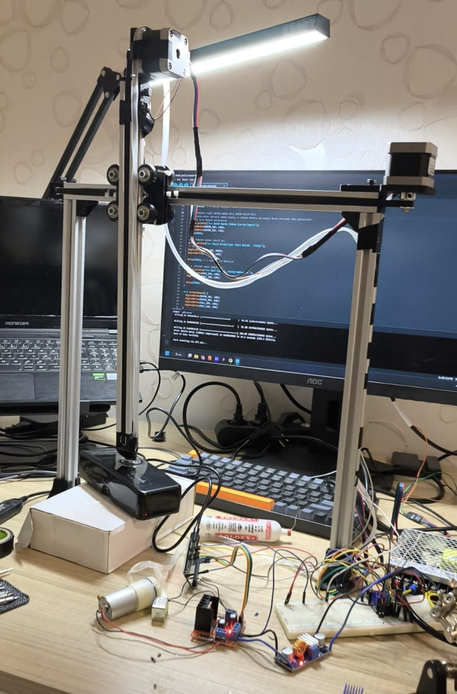

# Pick and Place Automation System (X–Z Axis)

## Overview
This project is a 2-axis (X–Z) pick and place automation system developed as a
mechatronics learning and prototyping project. The system performs sequential
motion control for automated object handling.

## System Features
- X–Z axis linear motion
- Stepper motor–driven positioning
- Homing sequence for repeatable motion
- Vacuum-based pick mechanism
- Sequential task execution logic

## Hardware Overview
- Control board
- Stepper motors and drivers
- Linear rails and belt mechanism
- Vacuum pump and solenoid valve
- Power supply units

## Motion Sequence
1. Homing (X axis → Z axis)
2. Z axis up
3. X axis forward
4. Z axis down
5. Vacuum ON
6. Z axis up
7. X axis return

## Project Structure

```
pick-and-place-automation/
├─ firmware/        → Control and motion logic
├─ hardware/        → Circuit diagrams and wiring
├─ mechanics/       → Mechanical design files
├─ media/           → Photos and videos of the system
└─ README.md
```

## Mobile Control (Optional Feature)

As an experimental add-on, the system can also be controlled remotely 
via a mobile application using Blynk and ESP32’s Wi-Fi capability.

This feature was added as a quick weekend experiment and is not part of 
the core system design.


## Status
Completed – open for further improvements and extensions.


## Notes
This project was developed for educational purposes to gain hands-on experience

## Media


